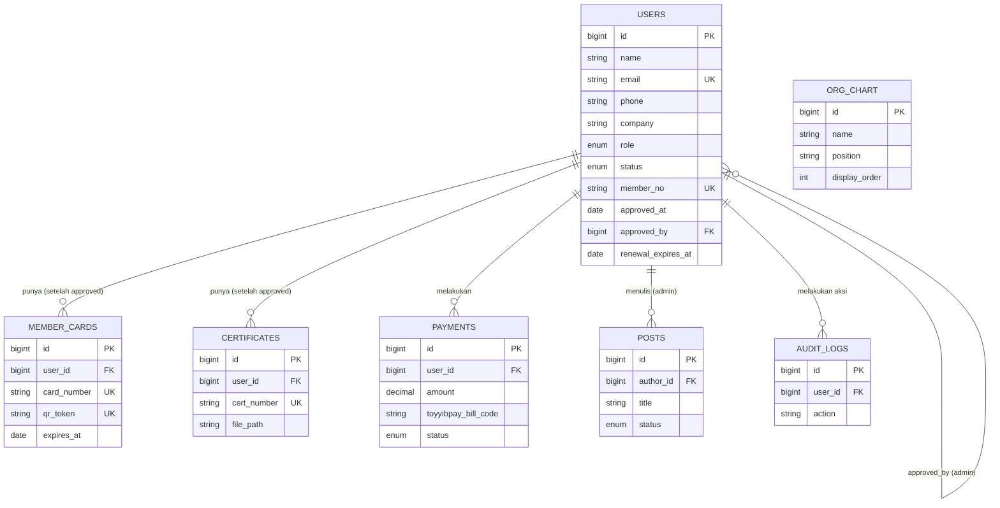

# NBBEU — Database Design

**Stack**: Laravel + MySQL + Filament
**Status**: Draft v1 — siap untuk migration development

---

## 1. Entity Relationship Diagram



> Catatan: `ORG_CHART` sengaja **tidak** direlasikan wajib ke `USERS` — sesuai keputusan bahwa org chart dikelola manual/statis oleh admin, bukan ditarik otomatis dari data ahli. Ini memberi fleksibilitas kalau ada pengurus yang bukan "ahli terdaftar" di sistem (mis. penasihat/advisor eksternal).

---

## 2. Tabel: `users`

Tabel inti — menyimpan admin & ahli sekaligus (single-table dengan kolom `role`), karena skala kecil (100-1000) tidak butuh pemisahan tabel `admins` vs `members` yang menambah kompleksitas join tanpa manfaat nyata.

| Kolom | Tipe | Keterangan |
|---|---|---|
| `id` | `bigint unsigned` PK | |
| `name` | `varchar(255)` | Wajib |
| `email` | `varchar(255)` UNIQUE | Wajib, dipakai login |
| `phone` | `varchar(20)` | Wajib (formulir minimal) |
| `company` | `varchar(255)` | Wajib (formulir minimal) |
| `password` | `varchar(255)` | Nullable — hanya diisi saat user set password (lihat §7 Auth Flow) |
| `role` | `enum('admin','member')` | Default `member` |
| `status` | `enum('pending','approved','rejected')` | Default `pending` |
| `member_no` | `varchar(20)` UNIQUE, nullable | **Diisi HANYA saat status → approved** (lihat §6) |
| `rejection_reason` | `text` nullable | Opsional, dicatat admin saat reject |
| `approved_at` | `timestamp` nullable | |
| `approved_by` | `bigint unsigned` FK → `users.id`, nullable | Admin mana yang approve |
| `renewal_expires_at` | `date` nullable | Diisi saat approved, +1 tahun dari tanggal approve |
| `email_verified_at` | `timestamp` nullable | |
| `created_at`, `updated_at` | `timestamp` | |

**Index**: `email` (unique), `status`, `member_no` (unique), `renewal_expires_at` (untuk query reminder job).

```sql
CREATE TABLE users (
    id BIGINT UNSIGNED AUTO_INCREMENT PRIMARY KEY,
    name VARCHAR(255) NOT NULL,
    email VARCHAR(255) NOT NULL UNIQUE,
    phone VARCHAR(20) NOT NULL,
    company VARCHAR(255) NOT NULL,
    password VARCHAR(255) NULL,
    role ENUM('admin','member') NOT NULL DEFAULT 'member',
    status ENUM('pending','approved','rejected') NOT NULL DEFAULT 'pending',
    member_no VARCHAR(20) NULL UNIQUE,
    rejection_reason TEXT NULL,
    approved_at TIMESTAMP NULL,
    approved_by BIGINT UNSIGNED NULL,
    renewal_expires_at DATE NULL,
    email_verified_at TIMESTAMP NULL,
    remember_token VARCHAR(100) NULL,
    created_at TIMESTAMP NULL,
    updated_at TIMESTAMP NULL,
    FOREIGN KEY (approved_by) REFERENCES users(id) ON DELETE SET NULL,
    INDEX idx_status (status),
    INDEX idx_renewal (renewal_expires_at)
);
```

---

## 3. Tabel: `payments`

Mencatat setiap transaksi Toyyibpay. Dipisah dari `users` karena satu user bisa punya banyak payment (renewal tahun berikutnya = row baru, bukan overwrite — penting untuk audit trail keuangan organisasi).

```sql
CREATE TABLE payments (
    id BIGINT UNSIGNED AUTO_INCREMENT PRIMARY KEY,
    user_id BIGINT UNSIGNED NOT NULL,
    amount DECIMAL(10,2) NOT NULL,
    purpose ENUM('registration','renewal') NOT NULL DEFAULT 'registration',
    toyyibpay_bill_code VARCHAR(100) NULL,
    toyyibpay_ref_no VARCHAR(100) NULL,
    status ENUM('pending','paid','failed') NOT NULL DEFAULT 'pending',
    paid_at TIMESTAMP NULL,
    created_at TIMESTAMP NULL,
    updated_at TIMESTAMP NULL,
    FOREIGN KEY (user_id) REFERENCES users(id) ON DELETE CASCADE,
    INDEX idx_status (status),
    INDEX idx_bill_code (toyyibpay_bill_code)
);
```

**Rasional penting**: `status` payment BUKAN sumber kebenaran untuk `users.status` — keduanya independen. User bisa `payments.status = paid` tapi `users.status = pending` (menunggu review admin), sesuai alur yang disepakati: **bayar dulu → admin approve**.

---

## 4. Tabel: `member_cards`

```sql
CREATE TABLE member_cards (
    id BIGINT UNSIGNED AUTO_INCREMENT PRIMARY KEY,
    user_id BIGINT UNSIGNED NOT NULL,
    card_number VARCHAR(50) NOT NULL UNIQUE,
    qr_token VARCHAR(100) NOT NULL UNIQUE COMMENT 'Random token untuk URL verifikasi publik',
    file_path VARCHAR(255) NULL COMMENT 'Path PDF/image kad yang di-generate',
    issued_at DATE NOT NULL,
    expires_at DATE NOT NULL,
    created_at TIMESTAMP NULL,
    updated_at TIMESTAMP NULL,
    FOREIGN KEY (user_id) REFERENCES users(id) ON DELETE CASCADE,
    INDEX idx_qr_token (qr_token)
);
```

`qr_token` **bukan** `user_id` mentah — pakai random string (mis. UUID/hash) supaya publik yang scan QR tidak bisa menebak/enumerate ID user lain. Endpoint verifikasi publik: `GET /verify/{qr_token}` → return data minimal saja (nama, no. ahli, status "Sah/Tidak Sah"), bukan data pribadi lengkap.

---

## 5. Tabel: `certificates`

```sql
CREATE TABLE certificates (
    id BIGINT UNSIGNED AUTO_INCREMENT PRIMARY KEY,
    user_id BIGINT UNSIGNED NOT NULL,
    cert_number VARCHAR(50) NOT NULL UNIQUE,
    file_path VARCHAR(255) NOT NULL,
    issued_at DATE NOT NULL,
    created_at TIMESTAMP NULL,
    updated_at TIMESTAMP NULL,
    FOREIGN KEY (user_id) REFERENCES users(id) ON DELETE CASCADE
);
```

---

## 6. Tabel: `posts` (Blog)

```sql
CREATE TABLE posts (
    id BIGINT UNSIGNED AUTO_INCREMENT PRIMARY KEY,
    author_id BIGINT UNSIGNED NOT NULL,
    title VARCHAR(255) NOT NULL,
    slug VARCHAR(255) NOT NULL UNIQUE,
    excerpt VARCHAR(500) NULL,
    content LONGTEXT NOT NULL,
    cover_image VARCHAR(255) NULL,
    status ENUM('draft','published') NOT NULL DEFAULT 'draft',
    published_at TIMESTAMP NULL,
    created_at TIMESTAMP NULL,
    updated_at TIMESTAMP NULL,
    FOREIGN KEY (author_id) REFERENCES users(id) ON DELETE CASCADE,
    INDEX idx_status_published (status, published_at)
);
```

---

## 7. Tabel: `org_chart`

```sql
CREATE TABLE org_chart (
    id BIGINT UNSIGNED AUTO_INCREMENT PRIMARY KEY,
    name VARCHAR(255) NOT NULL,
    position VARCHAR(255) NOT NULL,
    photo VARCHAR(255) NULL,
    display_order INT NOT NULL DEFAULT 0,
    is_active BOOLEAN NOT NULL DEFAULT TRUE,
    created_at TIMESTAMP NULL,
    updated_at TIMESTAMP NULL,
    INDEX idx_order (display_order)
);
```

Statis & manual sesuai keputusan — admin drag & drop urutan (`display_order`) via Filament.

---

## 8. Tabel: `audit_logs` (Rekomendasi tambahan)

Tidak diminta eksplisit, tapi **sangat disarankan** untuk organisasi resmi seperti union — supaya ada jejak siapa approve/reject siapa, kapan, dan aksi admin lain. Ini juga melindungi 2 admin yang setara aksesnya dari saling tuduh kalau ada perselisihan data.

```sql
CREATE TABLE audit_logs (
    id BIGINT UNSIGNED AUTO_INCREMENT PRIMARY KEY,
    user_id BIGINT UNSIGNED NULL COMMENT 'Admin yang melakukan aksi',
    action VARCHAR(100) NOT NULL COMMENT 'e.g. member.approved, member.rejected, post.published',
    subject_type VARCHAR(100) NULL,
    subject_id BIGINT UNSIGNED NULL,
    meta JSON NULL,
    created_at TIMESTAMP NULL,
    FOREIGN KEY (user_id) REFERENCES users(id) ON DELETE SET NULL,
    INDEX idx_subject (subject_type, subject_id)
);
```

> Laravel punya package siap pakai untuk ini (`spatie/laravel-activitylog`) — tidak perlu build manual, tinggal pasang dan attach ke model `User`, `Post`, dll.

---

## 9. Alur Generate `member_no`, Kad & Sertifikat

**Aturan kunci**: ketiganya HANYA dibuat saat `users.status` berubah menjadi `approved` (via Observer/Event di Laravel, bukan di controller langsung — supaya konsisten di manapun perubahan status terjadi, termasuk dari Filament admin panel).

```
Event: UserApproved
  ↓
Listener 1: GenerateMemberNumber
  → format: NBBEU-2026-0001 (tahun + running number, reset tiap tahun ATAU running terus — perlu diputuskan)
  ↓
Listener 2: GenerateMemberCard
  → buat qr_token, render PDF/image dari template, simpan file_path
  ↓
Listener 3: GenerateCertificate
  → buat cert_number, render PDF dari template, simpan file_path
  ↓
Listener 4: SendApprovalEmail
  → kirim email notifikasi + attach kad & sertifikat
```

Pendekatan event-driven ini juga memudahkan kalau nanti mau nambah listener baru (mis. kirim WhatsApp notif) tanpa ubah kode approval yang sudah ada.

---

## 10. Import/Export Excel — Pertimbangan Desain Data

Untuk **import**, kolom Excel harus mapping ke field minimal: `name, email, phone, company`. Baris gagal (email invalid/duplikat) **tidak boleh silent-fail** — sistem harus:
1. Proses semua baris valid
2. Kumpulkan baris gagal ke laporan terpisah (bisa pakai tabel sementara `import_errors` atau simpan sebagai file log yang bisa didownload admin)
3. Tampilkan ringkasan: "45 berhasil, 3 gagal (lihat detail)"

Untuk **export**, cukup query langsung dari `users` + join `payments`/`member_cards` sesuai kebutuhan laporan (mis. daftar ahli aktif tahun ini, daftar yang belum renewal).

---

## 11. Open Questions (perlu dijawab sebelum migration final)

- [ ] Durasi keanggotaan: 1 tahun dari `approved_at`? Atau tahun kalender tetap (semua expired 31 Des)?
- [ ] Format `member_no`: reset per tahun atau running number selamanya?
- [ ] Kalau `rejected`, apakah email tersebut boleh daftar ulang (row baru) atau update row yang sama?
